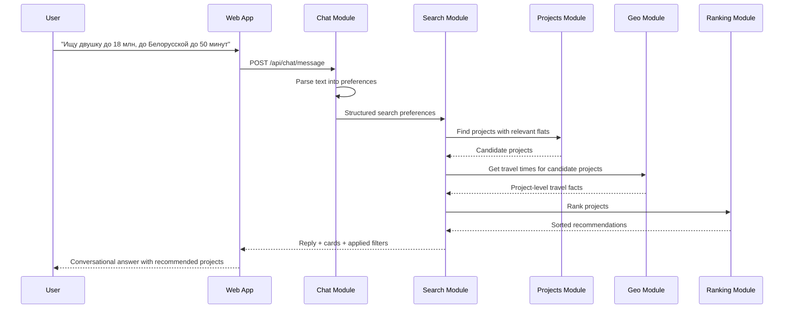

# Request Flow

```mermaid
sequenceDiagram
    participant U as User
    participant W as Web App
    participant C as Chat Module
    participant S as Search Module
    participant P as Projects Module
    participant G as Geo Module
    participant R as Ranking Module

    U->>W: "Ищу двушку до 18 млн, до Белорусской до 50 минут"
    W->>C: POST /api/chat/message
    C->>C: Parse text into preferences
    C->>S: Structured search preferences
    S->>P: Find projects with relevant flats
    P-->>S: Candidate projects
    S->>G: Get travel times for candidate projects
    G-->>S: Project-level travel facts
    S->>R: Rank projects
    R-->>S: Sorted recommendations
    S-->>W: Reply + cards + applied filters
    W-->>U: Conversational answer with recommended projects
```

